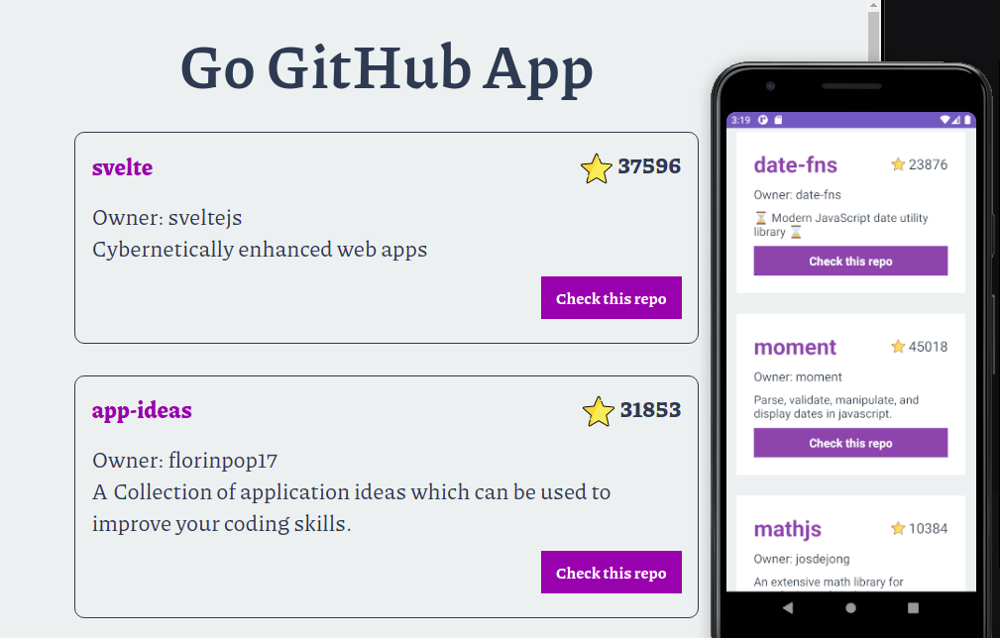

<p align="left">
   
</p>

# Go GitHub App

> Discover my favorites respositories from GitHub:)

[](https://github.com/jennifertakagi)
[](#)
[](https://github.com/jennifertakagi/go-github/stargazers)
[](https://github.com/jennifertakagi/go-github/network/members)
[](https://github.com/jennifertakagi/go-github/graphs/contributors)

---

# :pushpin: Table of Contents

* [Features](#rocket-features)
* [UI Documentation](#framed_picture-ui-documentation)
* [Installation](#construction_worker-installation)
* [Getting Started](#runner-getting-started)
* [FAQ](#postbox-faq)
* [Found a bug? Missing a specific feature?](#bug-issues)
* [Contributing](#tada-contributing)
* [License](#closed_book-license)

<br />

# :rocket: Features

* Select all ingredients that are on you bar
* Discover which drinks you can make *-*

# :framed_picture: UI Documentation
This project has a UI Documentation of reusable components, allowing to test them individually.

<p align="left">
   
</p>

# :construction_worker: Installation

**You need to install [NPM](https://www.npmjs.com/) and [Live Server](https://www.npmjs.com/package/live-server) first, then in order to clone the project via HTTPS, run this command:**

```git clone https://github.com/jennifertakagi/go-github.git```

SSH URLs provide access to a Git repository via SSH, a secure protocol. If you have a SSH key registered in your Github account, clone the project using this command:

```git clone git@github.com:jennifertakagi/go-github.git```

**Install dependencies**

You need to install the dependences in api, web and mobile folder, so **run the above command on root and in each of this folders**:

```yarn```

# :runner: Getting Started

Run the following command in **api and web** folder start the application in a development environment:

```yarn start```

On the **mobile** folder start the application in a development environment:

```yarn start && yarn android | yarn ios```

# :postbox: Faq

**Question:** What are the technologies used in this project?

**Answer:** The technologies used in this project are [React JS](https://pt-br.reactjs.org/), [React Native](https://reactnative.dev/) and [Node JS](https://nodejs.org/en/).

# :bug: Issues

Feel free to **file a new issue** with a respective title and description on the [Go GitHub](https://github.com/jennifertakagi/go-github/issues) repository. If you already found a solution to your problem, **i would love to review your pull request**! Have a look at our [contribution guidelines](https://github.com/jennifertakagi/go-github/blob/master/CONTRIBUTING.md) to find out about the coding standards.

# :tada: Contributing

Check out the [contributing](https://github.com/jennifertakagi/go-github/blob/master/CONTRIBUTING.md) page to see the best places to file issues, start discussions and begin contributing.

# :closed_book: License

Released in 2020.
This project is under the [MIT license](https://github.com/jennifertakagi/go-github/master/LICENSE).

